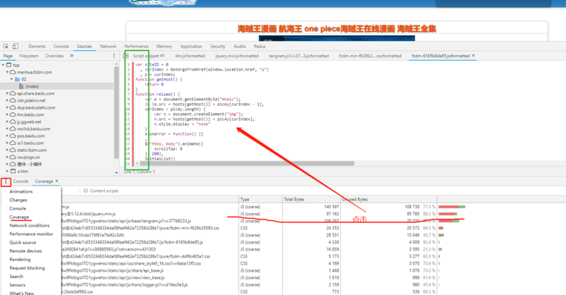

### css 性能优化

#### 基本条例
1. 使用id选择器
```css
/* Bad */
p#id1 {color:red;}  
/* Good */
#id1 {color:red;}
```
2. 避免选择器嵌套
```css
/* Bad */
div > div > div > p {color:red;} 
/* Good */
.p-class{color:red;}
```
3. 慎用子选择器

4. 不到万不得已，不要使用 attribute selector，如：p[att1=”val1”]
```css
/* Bad */
p[id="id1"]{color:red;}  
p[class="class1"]{color:red;}  
/* Good */
#id1{color:red;}  
.class1{color:red;}
```
5. 理解依赖继承，如果某些属性可以继承，那么自然没有必要在写一遍

6. 使用缩写语句，如下面所示的 margin 声明，可以从根本上减小 CSS 文件的大小。在 google 上搜索 CSS Shorthand 可以找到许多其他的速记形式。
```css
/* bad */
p {
    margin-top: 1px;
    margin-right: 2px;
    margin-bottom: 3px;
    margin-left: 4px;
}
/* good */
p {
    margin: 1px 2px 3px 4px;
}
```
7. 查找并删除未使用的 CSS

删除不必要的部分 CSS，j 显然会加快网页的加载速度。谷歌的 Chrome 浏览器有这种开箱即用的功能。只需转到查看>开发人员>开发人员工具，并在最近的版本中打开 Sources 选项卡，然后打开命令菜单。然后，选择 Show Coverage，在 Coverage analysis 窗口中高亮显示当前页面上未使用的代码，让您大开眼界。

打开谷歌浏览器开发都工具，在 Conlse 旁边更多选择 Coverage，就可以看到未使用的 CSS, 点击对应的项，高亮显示当前页面上未使用的代码，让你大开眼界：



8. 尽量使用 link 加载css
加载页面时，link标签引入的 CSS 被同时加载；@import引入的 CSS 将在页面加载完毕后被加载。

9. 用 CSS 替换图片
几年前，一套半透明的 png 在网站上创建半透明效果是司空见惯的。现在，CSS 过 滤器提供了一种节省资源的替代方法。例如，以下这个代码片段可以确保所讨论的图片显示为其自身的灰度版本。 png 透明图片 比 jpg 图片耗费资源更多
```css
img {
    -webkit-filter: grayscale(100%);
    /* old safari */
    filter: grayscale(100%);
}
```
10. 尽量不实用 函数形式的 css 值，不如 rgb() rgba() cacl()
```css
/* bad */
target {
    background-color: rgb(255,255,255);
}
/* good */
target {
    background: #fff;
}
```

11. 使用颜色快捷方式
常识告诉我们，六位数的颜色描述符是表达颜色最有效的方式。事实并非如此——在某些情况下，速记描述或颜色名称可以更短。
```css
/* bad */
target {
    background-color: #ffffff;
}
/* good */
target {
    background: #fff;
}
```

12. 删除不必要的零和单位
CSS 支持多种单位和数字格式。它们是一个值得感谢的优化目标——可以删除尾随和跟随的零，如下面的代码片段所示。此外，请记住，零始终是零，添加维度不会为包含的信息附带价值。

```css
/* bad */
padding: 0.2em;
margin: 20em;
avalue: 0px;
/* good */
padding: 0.2em;
margin: 20em;
avalue: 0;
```

13. 规范真的很重要，不仅仅是可读性，也许会影响你的页面性能。

#### vue 中使用

1. 使用 css module，不用 scoped 作用域
```html
<style lang='scss' module>
```

2. 使用 BEM 单独规范类名，嵌套少于3层

#### 参考
1. [Web 性能优化：21 种优化 CSS 和加快网站速度的方法](https://blog.fundebug.com/2019/03/18/21-method-to-optimize-css-and-speedup-web/)
2. [探究 CSS 解析原理](http://jartto.wang/2017/11/13/Exploring-the-principle-of-CSS-parsing/)